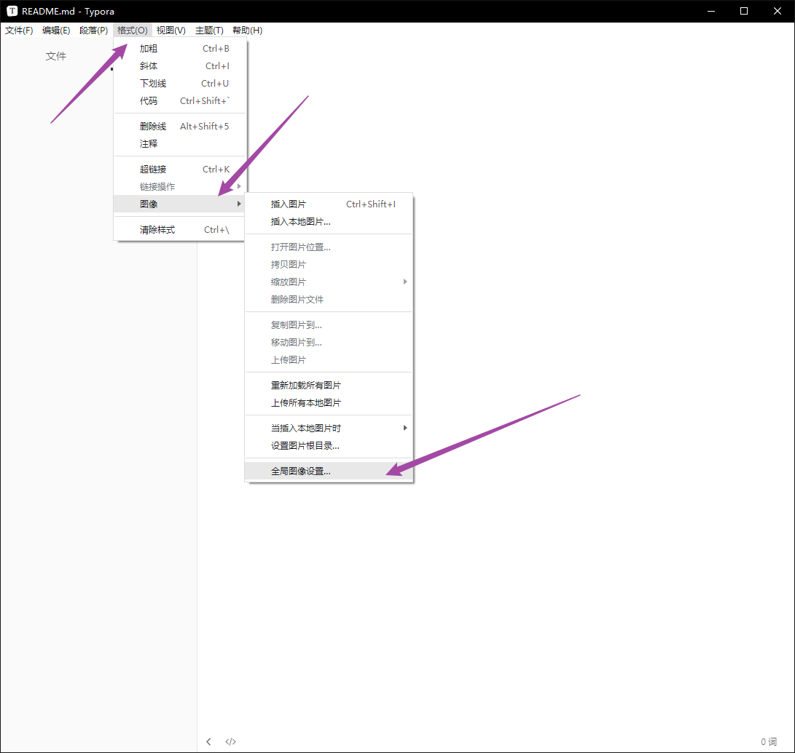
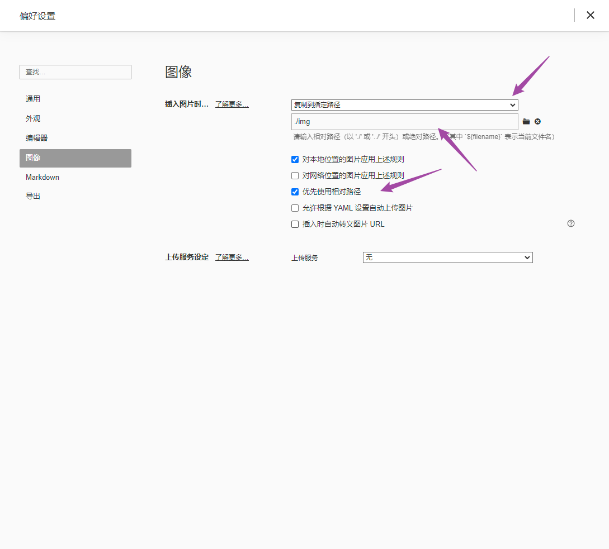

# 软件使用中的技巧


## cmd内网发送信息

```
MSG /server:内网ip * "找你没事情，下午出去玩吧"
```


## typora设置图片相对路径







## pr打不开 报错

```
Application Specific Information:
C:\Program Files\Adobe\Adobe Premiere Pro CC 2018\ZXPSignLib-minimal.dll


Thread 0 Crashed:	[18148]	THREAD_PRIORITY_NORMAL
0	ZXPSignLib-minimal  0x00000000056473e3 ? Unknown - (Symbols generated from a DLL export table)	[  Error:487 试图访问无效的地址。 ]
1	 ???? (  Error: 126 找不到指定的模块。 ) 0x00000000527a4d77 ? Unknown - ()	[  Error:126 找不到指定的模块。 ]
```

把pr中的文件复制到安装目录替换